# Agentic Task Capture System (Rust) - Microservices Architecture

A distributed, microservices-based agentic system that captures tasks from natural language input using LLM-based extraction. Built with Docker, PostgreSQL, and service-to-service HTTP communication for scalability and maintainability.

## 🏗️ Microservices Architecture

This system follows a **microservices architecture** with 5 independent services communicating via HTTP APIs:

```mermaid
graph TB
    User[👤 User/Bot/Email] --> Channel[🚪 Channel Service<br/>Port 8001<br/>Entry Point]
    
    Channel --> Case[📋 Case Management<br/>Port 8002<br/>Workflow & History]
    Channel --> AI[🤖 AI Agent Service<br/>Port 8004<br/>LLM Processing]
    
    Case --> Task[📝 Task Management<br/>Port 8003<br/>CRUD Operations]
    Case --> Persist[💾 Persistence Service<br/>Port 8005<br/>Database Layer]
    
    Task --> Persist
    AI --> Case
    AI --> Task
    AI --> OpenAI[🧠 OpenAI API<br/>GPT-3.5-turbo]
    
    Persist --> DB[(🗄️ PostgreSQL<br/>Port 5432<br/>Database)]
    
    subgraph "🐳 Docker Containers"
        Channel
        Case
        Task
        AI
        Persist
        DB
    end
    
    subgraph "🌐 External APIs"
        OpenAI
    end
    
    classDef service fill:#e1f5fe,stroke:#01579b,stroke-width:2px
    classDef database fill:#f3e5f5,stroke:#4a148c,stroke-width:2px
    classDef external fill:#fff3e0,stroke:#e65100,stroke-width:2px
    classDef user fill:#e8f5e8,stroke:#1b5e20,stroke-width:2px
    
    class Channel,Case,Task,AI,Persist service
    class DB database
    class OpenAI external
    class User user
```



## 🔧 Services Overview

### **1. Channel Service** (Port 8001)
- **Purpose**: Entry point for all user interactions
- **Endpoints**: `/bot`, `/email`, `/health`
- **Responsibilities**: 
  - Receive input from bots, email, or direct API calls
  - Route requests to appropriate services
  - Handle authentication and rate limiting

### **2. Case Management Service** (Port 8002)
- **Purpose**: Manages case lifecycle and conversation history
- **Endpoints**: `/cases`, `/cases/{id}`, `/cases/{id}/conversations`, `/health`
- **Responsibilities**:
  - Create and manage cases (conversation sessions)
  - Track conversation history and context
  - Manage case workflow and state transitions

### **3. Task Management Service** (Port 8003)
- **Purpose**: CRUD operations for individual tasks
- **Endpoints**: `/tasks`, `/tasks/{id}`, `/tasks/search`, `/health`
- **Responsibilities**:
  - Create, read, update, delete tasks
  - Task validation and business logic
  - Task search and filtering

### **4. AI Agent Service** (Port 8004)
- **Purpose**: LLM integration and task extraction
- **Endpoints**: `/extract`, `/process`, `/health`
- **Responsibilities**:
  - Process natural language input via OpenAI API
  - Extract structured task data from unstructured text
  - Provide fallback keyword-based extraction
  - Orchestrate multi-service workflows

### **5. Persistence Service** (Port 8005)
- **Purpose**: Database abstraction layer
- **Endpoints**: `/cases`, `/tasks`, `/conversations`, `/health`
- **Responsibilities**:
  - PostgreSQL database operations
  - Data validation and integrity
  - Query optimization and caching
  - Database migrations and schema management

## 🔄 Service Communication Flow

1. **User Input** → Channel Service receives request
2. **Case Creation** → Channel Service calls Case Management to create/retrieve case
3. **AI Processing** → Channel Service calls AI Agent Service for task extraction
4. **Task Creation** → AI Agent calls Task Management to create tasks
5. **Data Persistence** → All services use Persistence Service for database operations
6. **Response** → Channel Service returns structured response to user

## ✨ Architecture Benefits

- 🔄 **Scalable** - Each service can be scaled independently
- 🛡️ **Resilient** - Service failures don't bring down the entire system
- 🧪 **Testable** - Each service can be tested in isolation
- 🔧 **Maintainable** - Clear service boundaries and responsibilities
- 🚀 **Deployable** - Independent deployment and versioning
- 📊 **Observable** - Each service has health checks and logging
- 🔒 **Secure** - Service-to-service authentication and authorization

## 🚀 Quick Start with Docker

### Prerequisites
- Docker Desktop installed and running
- Git (to clone the repository)

### 1. Clone and Setup
```bash
# Clone the repository
git clone <your-repo-url>
cd tasks

# Copy environment template
cp .env.example .env

# Edit .env and add your OpenAI API key (optional)
# OPENAI_API_KEY=sk-your-actual-key-here
```

### 2. Start All Services
```bash
# Build and start all microservices
docker-compose up -d

# Check service status
docker ps

# View logs
docker-compose logs -f
```

### 3. Verify Services
```bash
# Check health endpoints
curl http://localhost:8001/health  # Channel Service
curl http://localhost:8002/health  # Case Management
curl http://localhost:8003/health  # Task Management
curl http://localhost:8004/health  # AI Agent Service
curl http://localhost:8005/health  # Persistence Service
```

### 4. Test the System
```bash
# Create a task via Channel Service
curl -X POST http://localhost:8001/bot \
  -H "Content-Type: application/json" \
  -d '{"message": "I need to call John tomorrow and buy groceries"}'
```

## 🌟 Features

- **🤖 Natural Language Processing**: Uses OpenAI GPT-3.5-turbo for intelligent task extraction
- **🏗️ Microservices Architecture**: 5 independent, scalable services
- **🐳 Docker Containerization**: Easy deployment and development
- **🗄️ PostgreSQL Database**: Robust data persistence and querying
- **🔄 Service Communication**: HTTP-based inter-service communication
- **🛡️ Health Monitoring**: Built-in health checks for all services
- **📊 Structured Logging**: Comprehensive logging across all services
- **🔧 Environment Configuration**: Flexible configuration management
- **🧪 Fallback Processing**: Keyword-based extraction when OpenAI unavailable

## Task Types Supported

- **Meeting**: date, time, participants, location, agenda
- **Shopping**: items, quantity, store, budget
- **Work**: priority, deadline, assignee, project
- **Personal**: location, reminder_time, category
- **Reminder**: reminder_date, reminder_time
- **Deadline**: due_date, priority
- **Call**: contact_person, phone_number, purpose
- **Email**: recipient, subject, priority
- **Travel**: destination, departure_date, return_date, booking_needed
- **Health**: appointment_date, doctor, type
- **Finance**: amount, category, due_date
- **Learning**: subject, duration, resources

## 🐳 Docker Deployment

### Service Ports
- **Channel Service**: `localhost:8001`
- **Case Management**: `localhost:8002`
- **Task Management**: `localhost:8003`
- **AI Agent Service**: `localhost:8004`
- **Persistence Service**: `localhost:8005`
- **PostgreSQL Database**: `localhost:5432`

### Docker Commands
```bash
# Start all services
docker-compose up -d

# Stop all services
docker-compose down

# Rebuild and restart
docker-compose up -d --build

# View logs for specific service
docker-compose logs -f channel-service
docker-compose logs -f case-management-service
docker-compose logs -f task-management-service
docker-compose logs -f ai-agent-service
docker-compose logs -f persistence-service

# Scale a specific service
docker-compose up -d --scale task-management-service=3
```

### Development Setup

1. **Prerequisites**:
   - Docker Desktop
   - Git
   - (Optional) Rust toolchain for local development

2. **Clone and Setup**:
   ```bash
   git clone <repository-url>
   cd tasks
   cp .env.example .env
   # Edit .env with your configuration
   ```

3. Copy the environment template and configure your API key:
   ```bash
   # Copy the example environment file
   cp .env.example .env
   
   # Edit .env and add your OpenAI API key
   # OPENAI_API_KEY=sk-your-actual-key-here
   ```

4. Build the project:
   ```bash
   cargo build --release
   ```

## 🚀 Usage

### Setting up OpenAI API (Optional)

For advanced LLM-based task extraction, set your OpenAI API key in `.env`:

```bash
# Copy the example file
cp .env.example .env

# Edit .env and add your API key
OPENAI_API_KEY=sk-your-actual-key-here

# Optional: Customize other settings
OPENAI_MODEL=gpt-3.5-turbo
OPENAI_TEMPERATURE=0.1
TASKS_FILE=my_tasks.json
```

Without an API key, the system will use intelligent fallback keyword-based extraction.

### Running the Application

```bash
cargo run
```

### Enhanced Commands

The refactored CLI supports more commands:

- **Natural Language Input**: Type your tasks naturally
  - Example: "I need to call John tomorrow at 2pm about the project meeting"
  - Example: "Buy milk, eggs, and bread from the grocery store"

- **Task Management**:
  - `list` or `ls` - Show all tasks
  - `list [type]` - Filter by task type (e.g., `list meeting`)
  - `list [status]` - Filter by status (`list pending`, `list completed`)
  - `complete [task_id]` - Mark a task as complete
  - `stats` - Show task statistics and completion rates

- **System Commands**:
  - `help` - Show detailed help information
  - `quit` - Exit the system

### Example Session

```
🤖 Agentic Task Capture System (Rust) - Refactored
===================================================
Commands:
- Type your tasks naturally (e.g., 'I need to call John tomorrow')
- 'list' or 'ls' - Show all tasks
- 'list [type]' - Show tasks of specific type
- 'list [status]' - Show tasks by status (pending, completed, etc.)
- 'complete [task_id]' - Mark task as complete
- 'stats' - Show task statistics
- 'help' - Show this help message
- 'quit' - Exit the system
===================================================

💬 Enter your input: I need to call Sarah about the meeting and buy groceries

Processing input: 'I need to call Sarah about the meeting and buy groceries'
Added task: Call Sarah about the meeting (call)
Added task: Buy groceries (shopping)
Saved 2 tasks to tasks.json
✅ Added 2 task(s) to your list!

💬 Enter your input: stats

📊 Task Statistics
━━━━━━━━━━━━━━━━━━━━━━━━━━━━━━━━━━━━━━━━━━━━━━━━━━━
📈 Total Tasks:      2
✅ Completed:        0
⏳ Pending:          2
🔄 In Progress:      0
❌ Cancelled:        0
🎯 Completion Rate:  0.0%
━━━━━━━━━━━━━━━━━━━━━━━━━━━━━━━━━━━━━━━━━━━━━━━━━━━
```

## Data Storage

Tasks are automatically saved to `tasks.json` in the current directory. The file contains:

- Task ID (UUID)
- Title and description
- Task type and status
- Creation timestamp
- Custom attributes based on task type

## Dependencies

- `serde` - Serialization/deserialization
- `serde_json` - JSON handling
- `tokio` - Async runtime
- `reqwest` - HTTP client for OpenAI API
- `chrono` - Date/time handling
- `uuid` - Unique ID generation
- `regex` - Pattern matching
- `clap` - Command line parsing (for future CLI enhancements)

## 📁 Project Structure

```
.
├── Cargo.toml                    # Workspace configuration
├── docker-compose.yml            # Multi-service Docker configuration
├── README.md                     # This documentation
├── .env.example                  # Environment template
├── migrations/                   # Database schema migrations
│   └── *.sql
├── shared/                       # Shared libraries
│   ├── models/                   # Common data structures
│   └── common/                   # Utility functions
└── services/                     # Microservices
    ├── channel-service/          # Entry point service
    │   ├── src/main.rs
    │   ├── Cargo.toml
    │   └── Dockerfile
    ├── case-management-service/  # Case lifecycle management
    │   ├── src/main.rs
    │   ├── Cargo.toml
    │   └── Dockerfile
    ├── task-management-service/  # Task CRUD operations
    │   ├── src/main.rs
    │   ├── Cargo.toml
    │   └── Dockerfile
    ├── ai-agent-service/         # LLM integration
    │   ├── src/main.rs
    │   ├── Cargo.toml
    │   └── Dockerfile
    └── persistence-service/      # Database layer
        ├── src/main.rs
        ├── Cargo.toml
        └── Dockerfile
```

## 🧪 Testing

### Service-Level Testing
```bash
# Test individual services locally (requires Rust toolchain)
cd services/channel-service && cargo test
cd services/case-management-service && cargo test
cd services/task-management-service && cargo test
cd services/ai-agent-service && cargo test
cd services/persistence-service && cargo test

# Test shared libraries
cd shared/models && cargo test
cd shared/common && cargo test
```

### Integration Testing
```bash
# Start services for integration testing
docker-compose up -d

# Run integration tests (example)
curl -X POST http://localhost:8001/bot \
  -H "Content-Type: application/json" \
  -d '{"message": "Test task creation"}'

# Check health endpoints
for port in 8001 8002 8003 8004 8005; do
  echo "Testing port $port:"
  curl -s http://localhost:$port/health || echo "Service on port $port not responding"
done
```

## ⚙️ Configuration

Environment variables (`.env` file):

| Variable | Default | Description |
|----------|---------|-------------|
| `OPENAI_API_KEY` | None | OpenAI API key for LLM extraction |
| `OPENAI_MODEL` | `gpt-3.5-turbo` | OpenAI model to use |
| `OPENAI_TEMPERATURE` | `0.1` | LLM response creativity (0.0-1.0) |
| `TASKS_FILE` | `tasks.json` | JSON file path for task persistence |

## 🔮 Future Enhancements

The modular architecture enables easy extension:

- **Speech-to-text integration** - Add voice input capability
- **Web interface** - Leverage existing services with a web frontend
- **Database storage** - Replace JSON with PostgreSQL/SQLite
- **Task scheduling** - Add time-based task execution and reminders
- **Team collaboration** - Multi-user task sharing
- **Plugin system** - Custom task type handlers
- **Mobile app** - Native mobile interface using the same core services
- **Task dependencies** - Support for task relationships and dependencies
- **Export capabilities** - Export to other formats (CSV, XML, etc.)
- **Task editing** - In-place task modification capabilities
